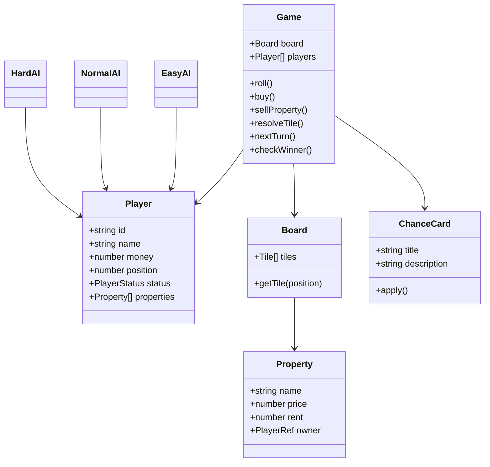

# 🎲 Mini Monopoly — TypeScript TUI

1 Player vs 3 Computers, turn-based, running on Bun.

## Features

- 24-tile mini board
- Human + Easy / Normal / Hard AI
- Dice → Move → Resolve Tile → Action → Next Turn
- Properties: buy / rent / sell
- Start, Tax, Jail, Chance, Free Parking
- 5 Chance cards
- Bankruptcy and last-player-standing victory
- JSON save (`save.json`)
- Core tests with Bun Test
- OOP classes/interfaces + functional pure functions / higher-order callbacks
- Logic separated from TUI

## Install

```bash
bun install
bun run start
```

## Test

```bash
bun test
```

## Type check

```bash
bun run check
```

## Controls

- `ENTER` / `R` — roll
- `B` — buy current property
- `S` — sell cheapest property
- `Q` / `Ctrl+C` — quit

## Architecture

```text
main.ts
  │
  ▼
ui/App.ts ────────────────┐
  │                       │
  ├── BoardView            │
  ├── PlayerView           │
  ├── GameLog              │
  └── ActionMenu           │
          │                │
          ▼                ▼
       Game.ts ──────── AI classes
          │             ├─ EasyAI
          │             ├─ NormalAI
          │             └─ HardAI
          │
          ├─ Board
          ├─ Player
          ├─ Property
          └─ Chance
```

## Class Diagram



## FP usage

- `movePosition()` is a pure function.
- `rollDice(random)` is deterministic when a random source is injected.
- `map`, `filter`, `sort`, and higher-order callbacks are used throughout the core.
- TUI only observes and triggers game actions; game rules do not depend on Blessed.

## Persistence

The TUI writes a lightweight JSON snapshot to `save.json` after the human turn. The save layer is isolated in `src/save.ts` so a full load/resume flow can be added without changing the game rules.
