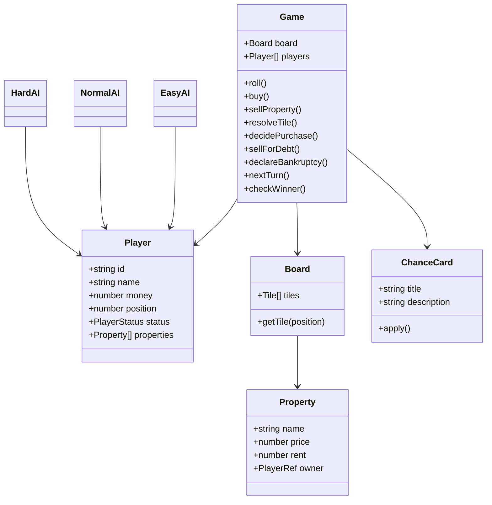

# 🎲 Mini Monopoly — TypeScript TUI

1 Player vs 3 Computers, turn-based, running on Bun.

## Features

- 32-tile world board (`Board32.ts`)
- Human + Easy / Normal / Hard AI
- Dice → Move → Resolve Tile → Action → Next Turn
- Properties: buy / rent / sell
- Tile types: Start, Property, Tax, Jail, Go To Jail, Chance, Free Parking
- 5 Chance cards
- Insufficient-funds handling: forced property sale or bankruptcy when the human player can't cover a debt (rent/tax)
- Bankruptcy and last-player-standing victory
- JSON save (`save.json`), written after each human turn
- OOP classes/interfaces + functional pure functions / higher-order callbacks
- Logic separated from TUI (game core does not import `blessed`)

## Install

```bash
bun install
bun run start
```

## Test

```bash
bun test
```

## Type check

```bash
bun run check
```

## Controls

- `ENTER` / `R` — roll
- `B` — buy current property
- `S` — sell cheapest property
- `N` — quit the app immediately
- `Q` / `Ctrl+C` — quit

> Note: the on-screen action bar currently labels `N` as "NEW", but it does not start a new game — it exits the app, same as `Q`.

## Architecture

```text
main.ts
  │
  ▼
ui/App.ts ────────────────┐
  │                       │
  ├── BoardView            │
  ├── PlayerView           │
  ├── GameLog              │
  ├── ActionMenu           │
  └── DiceView             │
          │                │
          ▼                ▼
       Game.ts ──────── AI classes
          │             ├─ EasyAI
          │             ├─ NormalAI
          │             └─ HardAI
          │
          ├─ Board (Board32 tile data)
          ├─ Player
          ├─ Property
          └─ Chance
```

## Class Diagram



## FP usage

- `movePosition()` is a pure function.
- `rollDice(random)` is deterministic when a random source is injected.
- `map`, `filter`, `sort`, and higher-order callbacks are used throughout the core.
- TUI only observes and triggers game actions; game rules do not depend on Blessed.

## Persistence

The TUI writes a lightweight JSON snapshot to `save.json` directly from `App.ts` after each human roll (via an inline `serialize()` + `Bun.write` call). A separate `save.ts` module also exists, exporting `writeSave` / `readSave` helpers for the same `SaveData` shape — but `App.ts` does not currently call into it. Wiring `App.ts` to use `save.ts` (and adding a load/resume flow on startup) is a natural next step without needing to touch the game rules.
