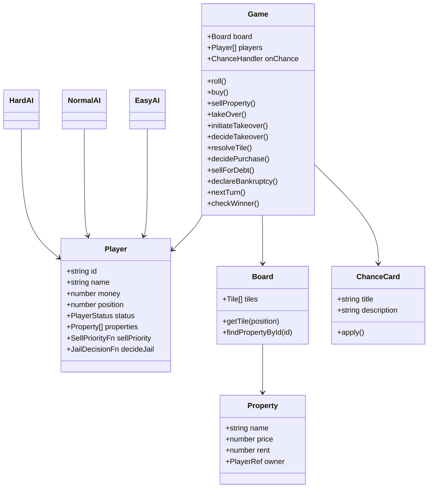

# 🎲 Mini Monopoly — TypeScript TUI

1 Player vs 3 Computers, turn-based, running on Bun.

## Features

- 32-tile world board (`Board32.ts`)
- Human + Easy / Normal / Hard AI
- Dice → Move → Resolve Tile → Action → Next Turn
- Properties: buy / rent / sell / **take over** from another player at 200% price
- Tile types: Start, Property, Tax, Jail, Go To Jail, Chance, Free Parking
- 5 Chance cards with popup notification (1.5–3s) when drawn
- Jailed players skip their turn automatically without rolling
- Insufficient-funds handling: forced property sale or bankruptcy when a player can't cover a debt
- Bankruptcy and last-player-standing victory
- JSON auto-save (`save.json`) written after each turn; resume on startup
- OOP classes/interfaces + functional pure functions / higher-order callbacks
- Logic separated from TUI (game core does not import `blessed`)

## Install

```bash
bun install
bun run start
```

## Test

```bash
bun test
```

## Type check

```bash
bun run check
```

## Controls

| Key | Action |
|-----|--------|
| `ENTER` / `R` | Roll dice |
| `B` | Buy current property (if unowned) |
| `S` | Sell cheapest property you own |
| `T` | Take over property you're standing on (must be owned by another player; costs 200% of original price) |
| `N` / `Q` / `Ctrl+C` | Quit |

## AI Behaviour

| Difficulty | Buy | Take Over | Jail |
|------------|-----|-----------|------|
| **Easy** | Always if affordable | Always if affordable | Never pays bail |
| **Normal** | Good rent + cash buffer + ≤4 properties | Same conditions as buy | Pays bail if cash buffer allows |
| **Hard** | ROI check + cash reserve | Only when behind & ROI positive | Pays bail when behind or portfolio full |

## Architecture

```text
main.ts
  │
  ▼
ui/App.ts ────────────────┐
  │                       │
  ├── BoardView            │
  ├── PlayerView           │
  ├── GameLog              │
  ├── ActionMenu           │
  └── DiceView             │
          │                │
          ▼                ▼
       Game.ts ──────── AI classes
          │             ├─ EasyAI
          │             ├─ NormalAI
          │             └─ HardAI
          │
          ├─ Board (Board32 tile data)
          ├─ Player
          ├─ Property
          └─ Chance
```

## Class Diagram



## FP usage

- `movePosition()` is a pure function.
- `rollDice(random)` is deterministic when a random source is injected.
- `map`, `filter`, `sort`, and higher-order callbacks are used throughout the core.
- TUI only observes and triggers game actions; game rules do not depend on Blessed.

## Persistence

`App.ts` auto-saves a JSON snapshot to `save.json` after every turn via `writeSave` from `save.ts`. On startup, if a save file exists, the mode-select screen offers a **Resume** option (`C`) that restores all player state, property ownership, and AI brains — always handing control back to the human player.
